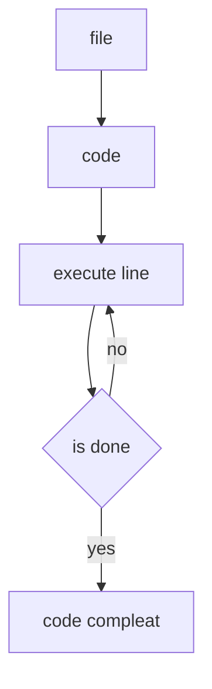

# The Ultimate Macro Language

## About

I was bored so i made this

Its a macro language that is ran using Python

**Requires the pip module pyautogui**

how to use/learn
>1. read basic syntax
>2. read command list for descriptions
>3. read more info on commands in other collapsed sections
>4. extra examples are macro.macro file
>5. write your macro in macro.macro file and run main.py

Todo:
>- figure out how to compile
>- add more hotkey functions

## Documentation

Basic Syntax

>(command)/(parameters)/(more parameters)
>
>examples:
>- move/x/500
>- click/2
>- type/hello world!

list of commands

- mouse movement
    >- move - modify the x or y of the mouse
    >- goto - set yhe x and y of the mouse
    >- setpos - set the x or y of the mouse
- mouse usage
    >- click - click once or twice
- keyboard
    >- key - press a key
    >- type - type in words
    >- hotkey - use a ctrl hotkey
    >- extra hotkeys (most of these have obvious uses)
    >>- copy - copy file or text
    >>- paste - paste file or text
    >>- cut - cut a file or text
    >>- delete - delete a file or text
    >>- selectall - select all text
    >>- undo - undo last key press or hotkey
    >>- redo - undo last undo
- miscellaneous
    >- execute - execute a command line command
    >- comment (// or #) - comment
    >- wait - pause the code

    extra information below

Mouse movement

move

>usage - move/(x or y)/(number)
>
>example - move/x/400
>
>advanced - move/random/(nothing, up, down, left, right)
>
>alternative - move/(x or y)/random/(nothing if x left/right if y up/down)
>
>>examples:
>>- move/x/random
>>- move/x/random/left
>>- move/random/up
>>- move/y/random

goto

>usage - goto/(x number)/(y number)
>
>>examples:
>>- goto/300/20
>>- goto/400/1000
>
>TODO implement random

setpos

>usage - setpos/(x or y)/(number)
>
>>examples
>>- setpos/x/999
>>- setpos/y/44
>>- setpos/y/500

Mouse usage

click

>usage click/(1 or 2)
>
>>examples:
>>- click/1
>>- click/2

Keyboard

key

>usage - key/(a key)
>
>>examples:
>>- key/a
>>- key/y
>>- key/space

type

>usage - type/(message)
>
>>examples:
>>- type/hello world
>>- type/this is a message
>>- type/hello

hotkey

>usage - hotkey/(a extra key ex: ctrl)/(a key)
>
>>examples:
>>- hotkey/ctrl/v
>>- hotkey/ctrl/z
>>- hotkey/alt/tab

paste

>usage - paste
>
>>examples:
>>- paste

copy

>usage - copy
>
>>examples:
>>- copy

Miscellaneous

Execute

>usage execute/(command)
>
>>examples:
>>- execute/echo hello world!
>>- execute/pip install numpy
>>- execute/npm init
>
>***Experimental may not work***

Comment

>usage - // or #
>
>>examples:
>>- // this is a comment
>>- '# this is also a comment'

wait

>usage - wait/(number)
>
>>examples:
>>- wait/6
>>- wait/2
>>- wait/20

## Technical details

This works by reading the macro.macro file and then goes line by line and

depending on the 1st thing before the / it executes code using pyautogui

Below is a flow chart to explain it

